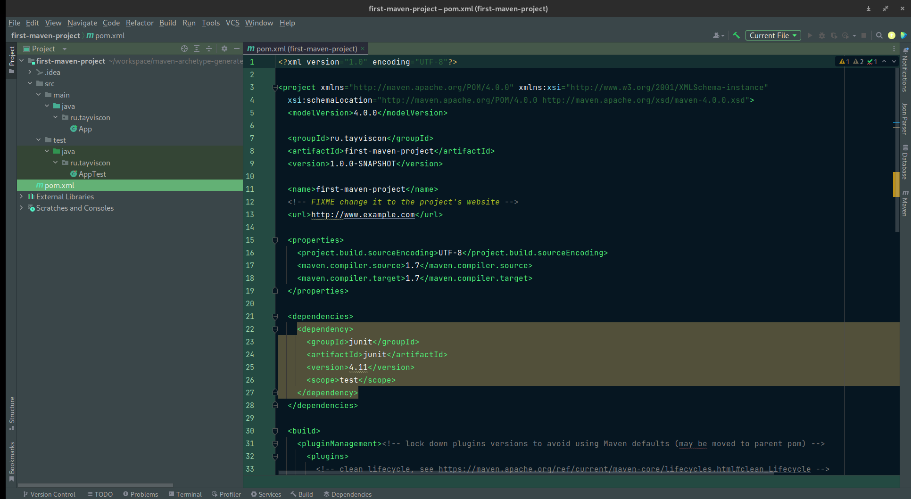

На данном занятии мы попробуем разобраться со структурой нашего Maven проекта, однако для
того, чтобы его создать нам понадобится еще один Maven плагин, который называется `Archetype`.

Давайте найдем наш **Archetype** плагин в скачанных исходниках проекта Maven. Для этого,
откроем папку `plugins` > `tools` > `archetype` > `maven-archetype-plugin`.

Давайте посмотрим описание нашего плагины при помощи **goal** `help`через терминал:
> `mvn archetype:help`
```text
[INFO] Scanning for projects...
[INFO] 
[INFO] ------------------< org.apache.maven:standalone-pom >-------------------
[INFO] Building Maven Stub Project (No POM) 1
[INFO] --------------------------------[ pom ]---------------------------------
[INFO] 
[INFO] --- maven-archetype-plugin:3.2.1:help (default-cli) @ standalone-pom ---
[INFO] Maven Archetype Plugin 3.2.1
  Maven Archetype is a set of tools to deal with archetypes, i.e. an abstract
  representation of a kind of project that can be instantiated into a concrete
  customized Maven project. An archetype knows which files will be part of the
  instantiated project and which properties to fill to properly customize the
  project.

This plugin has 7 goals:

archetype:crawl
  Crawl a Maven repository (filesystem, not HTTP) and creates a catalog file.

archetype:create-from-project
  Creates an archetype project from the current project.
  
  This goal reads your source and resource files, the values of its parameters,
  and properties you specify in a .property file, and uses them to create a
  Maven archetype project using the maven-archetype packaging. If you build the
  resulting project, it will create the archetype. You can then use this
  archetype to create new projects that resemble the original.
  
  The maven-archetype-plugin uses Velocity to expand template files, and this
  documentation talks about 'Velocity Properties', which are values substituted
  into Velocity templates. See The Velocity User's Guide for more information.
  
  This goal modifies the text of the files of the current project to form the
  Velocity template files that make up the archetype.
  
  GAV
    The GAV values for the current project are replaced by properties: groupId,
    artifactId, and version. The user chooses new values for these when
    generating a project from the archetype.
  package
    All the files under one specified Java (or cognate) package are relocated to
    a project that the user chooses when generating a project. References to the
    class name are replaced by a property reference. For example, if the current
    project's sources are in the package org.apache.saltedpeanuts, then any
    example of the string org.apache.saltedpeanuts is replaced with the Velocity
    property reference ${packageName}. When the user generates a project, this
    is in turn replaced by his or her choice of a package.
  custom properties
    You may identify additional strings that should be replaced by parameters.
    To add custom properties, you must use the propertyFile parameter to specify
    a property file. See the documentation for propertyFile for the details.
  integration tests
    You may also specify a set of integration tests to be executed right after
    you create archetype from the project. Each test consists of a separate
    folder under src/it/projects folder and in there you specify
    archetype.properties, goal.txt and verify.groovy files. The
    archetype.properties file is the file used to generate a new project from
    the newly created archetype and the goal.txt a single-line file to specify
    the maven goal to invoke after generation of the test-project. Finally the
    verify.groovy is a groovy file that you can use to specify your assertions
    on the generated project.
  
  Note that you may need to edit the results of this goal. This goal has no way
  to exclude unwanted files, or add copyright notices to the Velocity templates,
  or add more complex elements to the archetype metadata file.
  
  This goal also generates a simple integration-test that exercises the
  generated archetype.

archetype:generate
  Generates a new project from an archetype, or updates the actual project if
  using a partial archetype. If the project is fully generated, it is generated
  in a directory corresponding to its artifactId. If the project is updated with
  a partial archetype, it is done in the current directory.

archetype:help
  Display help information on maven-archetype-plugin.
  Call mvn archetype:help -Ddetail=true -Dgoal=<goal-name> to display parameter
  details.

archetype:integration-test
  Execute the archetype integration tests, consisting in generating projects
  from the current archetype and optionally comparing generated projects with
  reference copy.
  
  Each IT consists of a sub-directory in src/test/resources/projects containing:
  
  - a goal.txt file, containing a list of goals to run against the generated
    project (can be empty, content ignored before maven-archetype-plugin 2.1),
  - an archetype.properties file, containing properties for project generation,
  - an optional reference/ directory containing a reference copy of the expected
    project created from the IT.
  
  To let the IT create a Maven module below some other Maven project (being
  generated from another archetype) one can additionally specify an optional
  archetype.pom.properties file in the parent directory, specifying the
  archetype's groupId, artifactId and version along with its
  archetype.properties file, containing properties for project generation. Both
  files are leveraged to create the parent project for this IT. Parent projects
  can be nested.
  
  An example structure for such an integration test looks like this
  
  integration test folder structure
  File/Directory
  Description
  src/test/resources/projects/it1
  Directory for integration test 1
  src/test/resources/projects/it1/archetype.pom.properties
  GAV for the archetype from which to generate the parent
  src/test/resources/projects/it1/archetype.properties
  All required properties for the archetype being specified by
  archetype.pom.properties on this level
  src/test/resources/projects/it1/child
  Directory for maven module within integration test 1 (this folder's name is
  not relevant)
  src/test/resources/projects/it1/child/goal.txt
  The file containing the list of goals to be executed against the generated
  project
  src/test/resources/projects/it1/child/archetype.properties
  All required properties for this project's archetype
  Notice that it is expected to be run as part as of a build after the package
  phase and not directly as a goal from CLI.

archetype:jar
  Build a JAR from the current Archetype project.

archetype:update-local-catalog
  Updates the local catalog


[INFO] ------------------------------------------------------------------------
[INFO] BUILD SUCCESS
[INFO] ------------------------------------------------------------------------
[INFO] Total time:  0.548 s
[INFO] Finished at: 2022-12-01T10:36:04+03:00
[INFO] ------------------------------------------------------------------------
```

Анализируя данный текст, мы можем сделать вывод, что наш **Archetype** плагин имеет 7
**goal**-ов, однако интересующий нас называется `archetype:generate`, который позволяет
создавать нам новые проекты.

Давайте с помощью данной **goal** создадим самый простой проект, чтобы ознакомиться со
структурой нашего Java приложения с использованием Apache Maven для сборки проекта.

Мы с вами будем использовать архетип [quickstart](https://maven.apache.org/archetypes/maven-archetype-quickstart/):
> `mvn archetype:generate -DarchetypeGroupId=org.apache.maven.archetypes -DarchetypeArtifactId=maven-archetype-quickstart -DarchetypeVersion=1.4`
,

где через пользовательские **JVM options** передаем необходимые нам аргументы:
> **archetypeGroupId**

> **archetypeArtifactId**

> **archetypeVersion**

Именно эти параметры используются для определения уникального плагина.

Стоит отметить, что прописывать данную команду мы должны в папке, которая еще
не является maven проектом.

После запуска команды, терминал запрашивает `GroupId`, для проекта, который мы прямо
сейчас создаем. Давайте же разберемся, что такое `GroupId`, `ArtifactID`, `Version`:
В Maven есть специальная конвенция, для наименования проектов, плагинов и прочего.
Таким образом уникальное имя проекта состоит из трех значений:
> `groupId:artifactId:version`

Также стоит отметить, что для **groupId** используется название компании, например:
> `ru.tayviscon` - именуется все с маленькой буквы и составляющие разделяются точкой

Далее терминал запрашивает у нас `artifactId`, то есть уникальное название проекта
в рамках одной группы. Задайте произвольное имя: я выбрал `first-maven-poject`.

Теперь терминал запрашивает у нас третью составляющую нашего уникального названия `version`.
Стоит отметить, что версия тоже состоит из трех составляющих:
> `major.minor.increment-qualifier`, где

> **major** - главная версия нашего проекта (*полноценный релиз*)

> **minor** - минорная версия (*вышел какой-то фикс или может быть маленький релиз*)

> **increment** - (*зачастую используется для отображения баг фиксов*)

> **-qualifier** - (*чаще всего можно увидеть `SNAPSHOT`, который обозначает, что это
> не версия, используемая в продакшене, а версия, используемая во время разработки*)

Давайте зададим для нашего проекта версию:
> `1.0.0-SNAPSHOT`

Теперь терминал предлагает выбрать название для пакета, который будет
использоваться в проекте. Если ничего не вписывать, то название пакета будет точно
таким же как и **groupID**, что меня вполне устраивает, однако вы можете задать свое
значение.

Maven показывает нам, что он создаст. Если нас все устраивает нажимаем на кнопку
`Enter` и ждем пока проект соберется, о чем нам сообщит надпись `[INFO] BUILD SUCCESS`.

Давайте теперь откроем наш проект при помощи IntelliJ IDEA.



Здесь мы видим наш основной конфигурационный файл `pom.xml`, а также папку `src`, где
в дальнейшем будут храниться наши исходники, однако стоит отметить, что в отличие от
обычных проектов в нем уже есть два других каталога: `main` и `test`:
> **main** используется для нашего основного кода

> **test** используется для тех классов, которые тестируют классы, находящиеся в *main*

Именно так будет выглядеть структура любого Maven приложения.

Таким образом, благодаря Apache Maven конвенции у нас все проекты имеют одинаковую
структуру и **pom.xml** файл, который занимается конфигурацией нашего проекта.