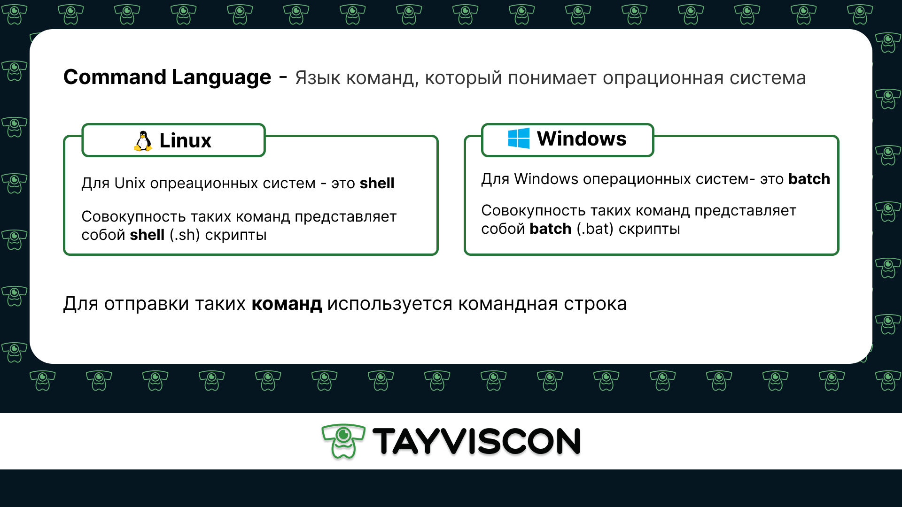
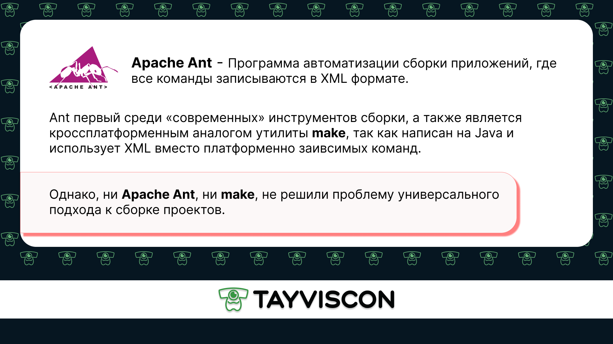
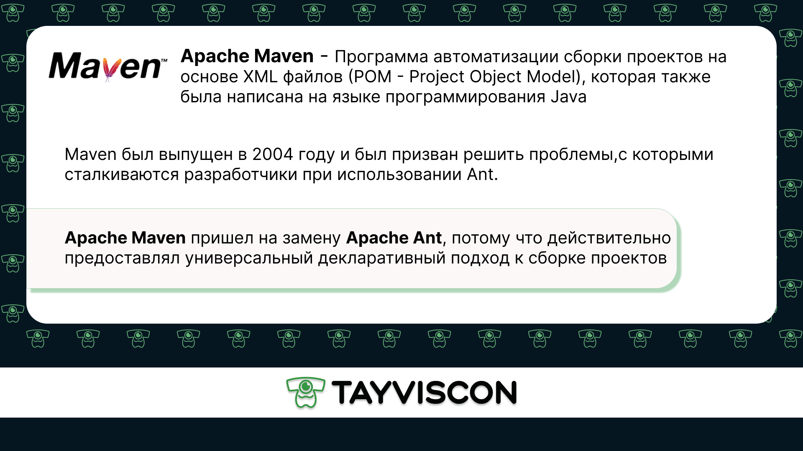
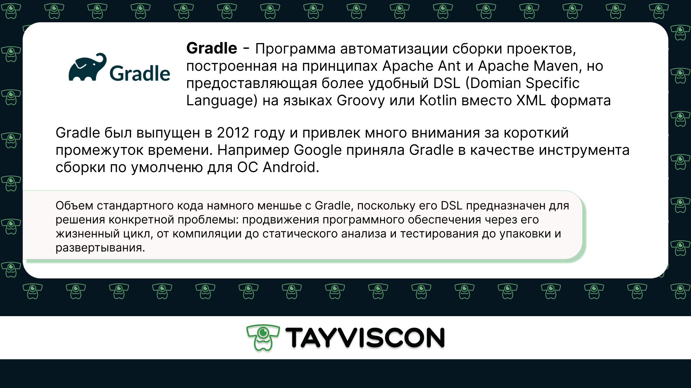

Apache Maven - фреймворк для автоматизированной сборки проектов на основе описания их
структуры в файлах на языке POM, являющимся подмножеством XML.

Давайте посмотрим на то, как раньше разработчики занимались сборкой своих проектов.
Для этого немного углубимся в историю, а также освежим в памяти несколько базовых
понятий.

Стоит отметить, что команда состоит из уникального названия и списка параметров,
разделенных пробелами: `command [arg1 arg2 args3 ...]`, однако самих парамеров
может и не быть вовсе.

Скрипты также могут быть вызваны через командную строку. Для этого достаточно набрать
имя скрипта, однако надо убедиться, что у пользователя есть права на выполнение этого
скрипта (`execute`).

Именно скрипты раньше использовались для самых различных задач: сборка проекта, запуск
тестов, деплой приложения и т. д.

Однако использование такого рода скриптов весьма неудобно как минимум из-за того, что
они являются платформенно зависимыми:

> `shell`-скрипты используются для `Unix` систем

> `batch`-скрипты используются для `Windows` систем

Ещё одним, не менее существенным недостатком такого подхода было то, что каждый из проектов
содержал свои такие скрипты, не подходящие для других проектов.

Для того чтобы решить данную проблему, был создан **Apache Ant**.

Несмотря на то, что **Ant** имел очень низкий порог вхождения, позволяя любому начать
использовать его без какой-либо специальной подготовки, он всё же не решил проблему
универсального подхода к сборке проектов, так как каждый проект имел свою собственную
структуру, жизненный цикл и свои сценарии сборки. Именно из-за этой особенности программы,
новые разработчики не могли быстро добавлять изменения в сценарии, а также увеличивалось
время ознакомления с проектом.

Именно необходимость в более строгих правилах или конвенциях при сборке проекта,
явилась катализатором для разработки **Apache Maven**.

  

Таким образом, Apache Maven содержал конвенцию, которая строго определяла, как должен
выглядеть тот или иной проект, что позволило программистам при переходе с одного
проекта на другой сэкономить время на ознакомление с проектом: его структурой и
процессом сборки.

Однако написанная на непрерывном XML конфигурация Maven, является
большой и громоздкой, что в свое время повысило интерес к **DSL** (предметно-ориентированным языкам),
идея которых состояла в том, чтобы иметь языки, предназначенные для решения проблем,
относящихся к определенной области. Одним из результатов применения DSL стал **Gradle**.

Таким образом, **Gradle** обладает мощностью и гибкостью **Ant**, а также жизненным
циклом **Maven**, однако, чтобы его начать изучать необходимо освоить как минимум один 
из языков DSL и что не менее важно - `понять процесс автоматизации сборки проектов` на
примере Apache Maven, чем мы и займемся на этом курсе.