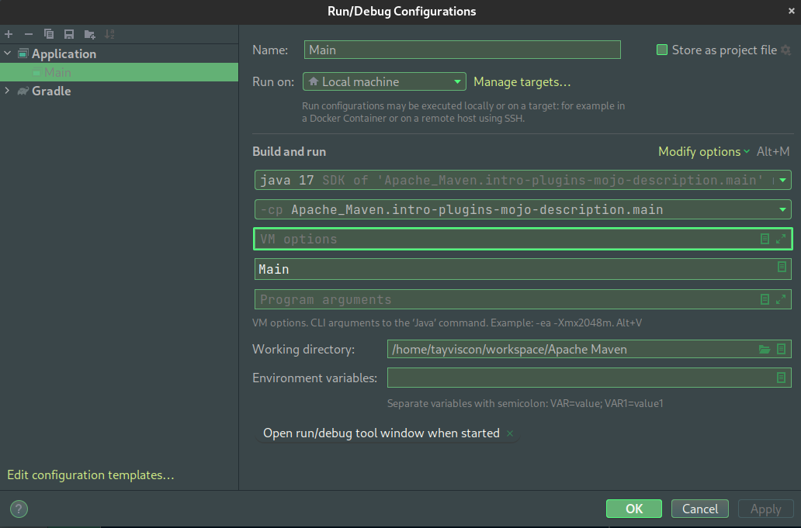
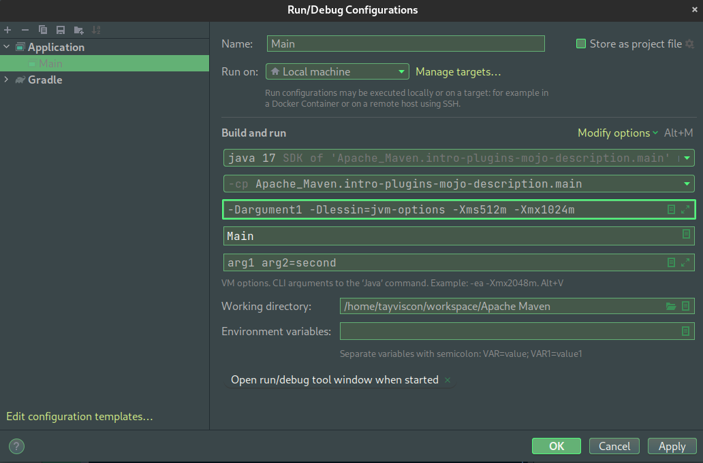
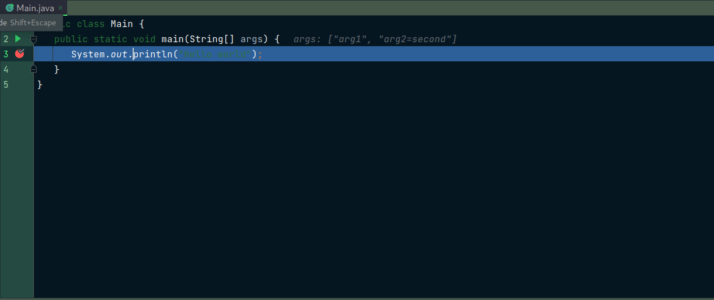
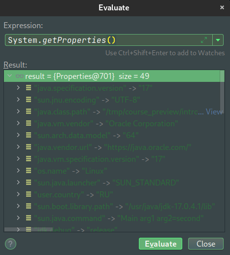

Для Java приложений характерно передавать параметры через командную строку:

> Параметры начинающиеся с символа `-D` называются **JVM аргументами**

Стоит также отметить, что существуют и обычные аргументы, которые мы можем принимать
в виде массива строк в нашем методе `main(String[] args)`.

Давайте перейдем к конфигурации нашего приложения:
> `Run` > `Edit Configurations...`



Как мы можем увидеть, у нас есть два варианта, с помощью которых передаются аргументы:
> **VM options** - аргументы JVM

> **Program arguments** - аргументы в виде массива строк

Давайте попробуем добавить JVM options. Однако уточним, что есть некоторые
их разновидности:

| Префикс | Описание                                                       |
|---------|----------------------------------------------------------------|
| -D      | Аргументы придуманные пользователем (User JVM arguments)       |
| -X      | Нестандартные зарезервированные JVM options ([Документация](https://www.oracle.com/java/technologies/javase/vmoptions-jsp.html))|
| -XX     | Расширенные зарезервированные JVM options  ([Документация](https://www.oracle.com/java/technologies/javase/vmoptions-jsp.html))|

Необходимо учесть, что все аргументы должны разделяться пробельным символом.

Зададим **JVM options** в соответствующем поле:

```text
-Dargument1
-Dlessin=jvm-options
-Xms512m
-Xmx1024m
```

Также зададим **Program arguments** в соответствующем поле:
```text
arg1
arg2=second
```


Давайте теперь перейдем к классу
[Main](course://intro/jvm-arguments/theory/src/main/java/Main.java) и поставим там точку
останова напротив строки `System.out.println("Hello World")` и запустим наш код в режиме `debug`.



Теперь в массиве `args` мы видим заданные нами параметры. Стоит также отметить, что
аргументы **args[]** методы **main** не имеют формата, в отличие от пользовательских JVM -D.

Однако нас сейчас интересуют как раз таки JVM options. Для того чтобы нам их исследовать
необходимо перейти в раздел `Evaluate Expression...` через интерфейс **debug** режима, либо
использовать сочетание клавиш: `Alt` + `Shift` + `8`. Получить доступ к нашим аргументам
можно используя класс `System` и его метод `getProperties()`.  



Как мы можем увидеть, некоторые значения передаются по умолчанию, когда мы запускаем наше 
Java приложение. В этом же списке мы можем найти заданные нами значения, которые мы
указывали с префиксом `-D`. Однако зарезервированные аргументы (`-X` и `-XX`) мы 
получить не можем.

Стоит также отметить, что с помощью класса `System` и его метода `getenv()`, мы можем 
получить наши переменные среды и окружения.

Таким образом, во время запуска Java приложения мы можем дополнительно передавать 
различные аргументы для того, чтобы настраивать процесс запуска и конфигурацию 
нашего проекта.