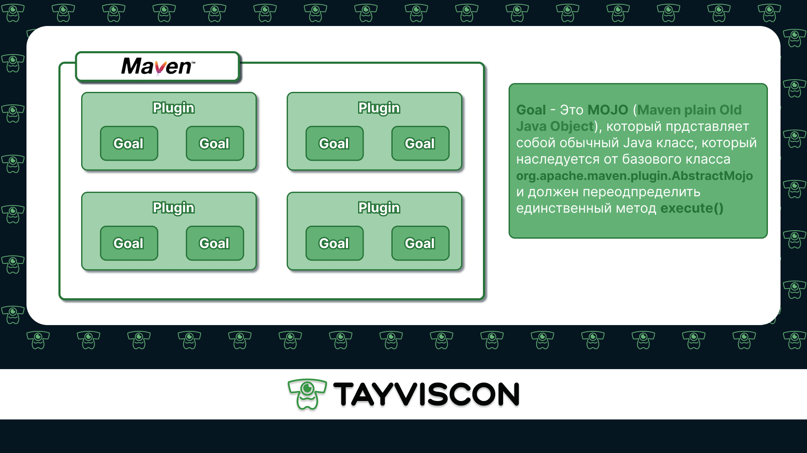
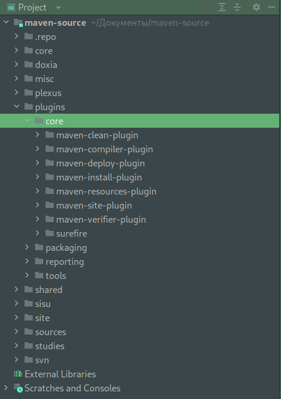
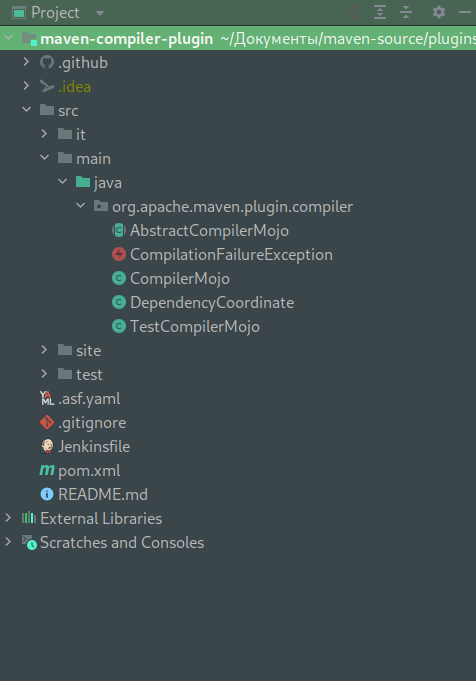

Давайте же разберем из чего на самом деле состоит **Maven** и какая роль у 
плагинов (*Plugin*), целей (*Goal*).

Maven - это совокупность плагинов, которые являются его основной частью. Таким образом
наше непосредственное взаимодействие с Apache Maven не что иное, как взаимодействие с 
этими плагинами.  

Однако если мы копнем чуть глубже и попытаемся изучить исходный код
Maven, то увидим, что каждый плагин представляет собой Java проект, который
состоит из набора классов и главные из этих классов как раз таки **goal**.

Стоит отметить, что каждый плагин может содержать количество goal от одного
до бесконечности, однако плагины должны иметь одну обязательную цель `help`,
которая нужна для того, чтобы описать плагин.  



Реализация метода `execute()` и есть то, что выполняет наша **goal**
в плагине. Таким образом, все, что мы будем в дальнейшем делать - работа с плагинами
посредством вызова у них **goal** или их совокупности.

Давайте скачаем, согласно [инструкции](https://maven.apache.org/scm.html),
исходный код Apache Maven, чтобы более подробно разобраться в нем.

Главный пакет, который нас интересует - **plugins**, так как именно плагины являются
ядром Apache Maven. На этом уроке мы рассмотрим наиболее используемые плагины из пакета
**core**.  



Давайте рассмотрим `maven-compiler-plugin`, который занимается компиляцией нашего
проекта. Для этого откройте **maven-compiler-plugin** как отдельный проект при помощи
IntelliJ IDEA.  



Давайте рассмотрим класс `CompilerMojo`. Как мы можем увидеть **CompilerMojo** это
цель с названием ***compile*** и которая наследуется от `AbstractCompilerMojo`, который
в свою очередь наследуется от класса `AbstractMojo`.
```java
@Mojo( name = "compile", defaultPhase = LifecyclePhase.COMPILE, threadSafe = true, requiresDependencyResolution = ResolutionScope.COMPILE)
public class CompilerMojo extends AbstractCompilerMojo {
    ...
}
```

Необходимо обратить внимание на то, что наш `AbstractMojo` имплементирует интерфейс 
`Mojo`, который содержит три метода. В частности метод `execute()` 
содержащий основной функционал для выполнения **goal**, а также методы
`setLog(Log var1)` и  `getLog()`, но так как эти методы постоянно повторяются из одного
**Mojo**-объекта в другой, они переопределены в `AbstractMojo`. Таким образом, нам для
создания своей **goal** необходимо просто наследоваться от класса **AbstractMojo**
и реализовать свой метод **execute()**.
```java
public interface Mojo {
    String ROLE = Mojo.class.getName();

    void execute() throws MojoExecutionException, MojoFailureException;

    void setLog(Log var1);

    Log getLog();
}
```

Стоит также отметить, что наш `CompilerPlugin` состоит из трех основных целей:
> **compile** - для того, чтобы скомпилировать наш исходный код

> **testCompile** - для того, чтобы скомпилировать исходный код тестов

> **help** - для описания нашего плагина 

Давайте попробуем вызвать цель **help**. Для этого запустим из терминала команду:
> `mvn compiler:help`

Теперь в выводе мы можем увидеть описание нашего плагина:
```text
[INFO] Scanning for projects...
[INFO] 
[INFO] -----------< org.apache.maven.plugins:maven-compiler-plugin >-----------
[INFO] Building Apache Maven Compiler Plugin 3.11.0-SNAPSHOT
[INFO] ----------------------------[ maven-plugin ]----------------------------
[INFO] 
[INFO] --- maven-compiler-plugin:3.10.1:help (default-cli) @ maven-compiler-plugin ---
[INFO] Apache Maven Compiler Plugin 3.10.1
  The Compiler Plugin is used to compile the sources of your project.

This plugin has 3 goals:

compiler:compile
  Compiles application sources

compiler:help
  Display help information on maven-compiler-plugin.
  Call mvn compiler:help -Ddetail=true -Dgoal=<goal-name> to display parameter
  details.

compiler:testCompile
  Compiles application test sources.


[INFO] ------------------------------------------------------------------------
[INFO] BUILD SUCCESS
[INFO] ------------------------------------------------------------------------
[INFO] Total time:  0.316 s
[INFO] Finished at: 2022-11-30T17:33:12+03:00
[INFO] ------------------------------------------------------------------------
```

Строка `[INFO] BUILD SUCCESS` символизирует нам о том, что исполнение плагина успешно завершилось
и теперь мы видим его описание. Для того чтобы получить более подробное
описание, мы можем вызвать команду **help** с дополнительными параметрами:

> `mvn compiler:help -Ddetail=true`

Таким образом, мы поняли, что вызвать какой-либо **plugin** и его **goal** весьма просто,
нам необходимо всего-лишь набрать название плагина и через двоеточие его **goal**.
Помимо этого мы убедились, что **goal** это всего лишь обычный Java класс, который 
наследуется от базового класса `AbstractMojo` и в нем переопределен лишь единственный
главный метод `execute()`, в котором содержится функционал для выполнения основной
задачи нашей **goal**.